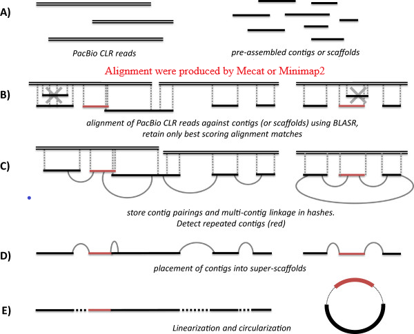

Run_sspace-longread: an optimized edition of SSPACE-LongRead
==============================================================
Run_sspace-longread is an optimized edition of SSPACE-LongRead. 
We use the software mecat and minimap2 to align the raw Pacbio 
reads to the assembled contigs or scaffold insteading of blasr.
Both of them have a higher efficiency than the software blasr, 
which is nearly 10 times faster.

Run_sspace-longread is free for academic and non-profit use 
(see :ref:`License <license>`).

   Run_sspace-longread pipeline. The workflow using long read sequence information to construct longer scaffolds
.. toctree::
   :maxdepth: 2
   :caption: Contents:

.. _getting-started:

.. toctree::
   :hidden:
   :caption: Getting started
   :maxdepth: 3

   install
   quickstart
   example
   result

.. toctree::
   :hidden:
   :caption: Reference
   :maxdepth: 2

   reference
   
.. toctree::
   :hidden:
   :caption: Release note
   :maxdepth: 2

   release 

.. toctree::
   :hidden:
   :caption: License
   :maxdepth: 2

   license