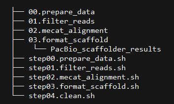
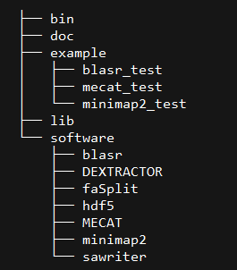

.. |br| raw:: html

    

.. _ref-result:

Results
==========

Compared SSPCAE-Longread result
^^^^^^^^^^^^^^^^^^^^^^^^^^^^^^^^^^^^^^^^^^^^^^^^^^^^^^^^^^^^^^^^^^^^

The SSPACE-Longread results for the 700M genome using 100X pacbio raw data.

+-----------+------------+------------+--------------+----------+----------+----------+
|Title      |Total_length|Total_number|Average_length|Max_length|N50_length|N50_number|
+===========+============+============+==============+==========+==========+==========+
|origin     |639825632   |999         |640466        |16181927  |2882448   |69        |
+-----------+------------+------------+--------------+----------+----------+----------+
|blasr      |642116045   |587         |1093894       |33856258  |5548795   |32        |
+-----------+------------+------------+--------------+----------+----------+----------+
|mecat      |642884676   |414         |1552861       |24217045  |7946167   |24        |
+-----------+------------+------------+--------------+----------+----------+----------+
|minimap2   |641969645   |629         |1020619       |23023348  |5494316   |33        |
+-----------+------------+------------+--------------+----------+----------+----------+
|mecat_v3   |642456360   |377         |1704128       |33365141  |9881326   |19        |
+-----------+------------+------------+--------------+----------+----------+----------+
|minimap2_v3|641923953   |627         |1023802       |21763267  |5470150   |34        |
+-----------+------------+------------+--------------+----------+----------+----------+

*v3: the result of v1.3, which is revised the alignment position in minus strand.*

Compared speed 
^^^^^^^^^^^^^^^^^^^^^^^^^^^^^^
In order to compare running speed, we align 8G raw pacbio to refence genome using blasr, mecat and minimap2 with 8 CUP, respectively.

		+-----------+------------+
		|  Software |   Time     |
		+===========+============+
		|blasr      |2h26min     |
		+-----------+------------+
		|mecat      |34min       |
		+-----------+------------+
		|minimap2   |33min       |
		+-----------+------------+

Working directory structure
^^^^^^^^^^^^^^^^^^^^^^^^^^^^^^

   
   
Pipeline directory structure
^^^^^^^^^^^^^^^^^^^^^^^^^^^^^^

   
   
   
